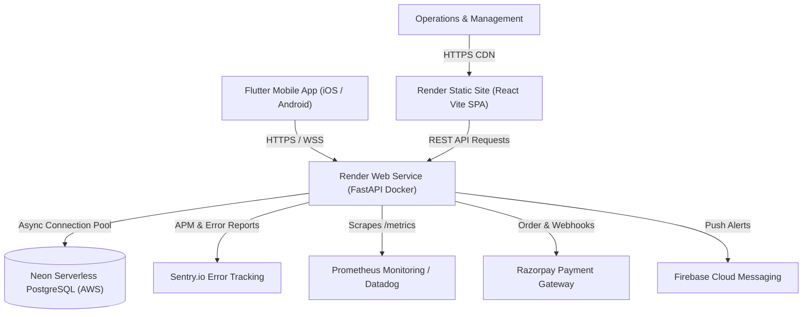

# Instant Reel — Production Deployment Runbook

Comprehensive production deployment guide for the **Instant Reel** on-demand reel creator platform.

---

## Architecture Overview



---

## 1. Database Provisioning: Neon PostgreSQL

Instant Reel utilizes **Neon Serverless PostgreSQL** for database persistence.

1. Log into your [Neon Console](https://console.neon.tech).
2. Select your project (e.g., `instant-reel-db`) in region `ap-southeast-1` (Singapore) or `us-west-2` (Oregon).
3. Retrieve your connection credentials:
   - **Async Connection String** (Used by FastAPI):
     ```bash
     postgresql+asyncpg://<username>:<password>@ep-xxxx.ap-southeast-1.aws.neon.tech/neondb?ssl=require
     ```
   - **Sync Connection String** (Used by Alembic migrations):
     ```bash
     postgresql://<username>:<password>@ep-xxxx.ap-southeast-1.aws.neon.tech/neondb?sslmode=require
     ```
4. **Run Migrations against Neon**:
   ```bash
   cd backend
   alembic upgrade head
   ```

---

## 2. Deploying via Render Blueprint (`render.yaml`)

The repository includes a production **Render Blueprint** (`render.yaml`) that configures both the backend container and the static admin panel automatically.

### Step-by-Step Deployment:
1. Push your repository to GitHub: `https://github.com/bathikadileep/Instant-reel-creator`.
2. Open the [Render Dashboard](https://dashboard.render.com).
3. Click **New +** > **Blueprint**.
4. Connect your GitHub repository: `bathikadileep/Instant-reel-creator`.
5. Render will automatically detect `render.yaml` and provision two services:
   - **`instant-reel-api`** (Docker Web Service)
   - **`instant-reel-admin`** (Static Site CDN)
6. Configure the secret environment variables in the Render dashboard:
   - `DATABASE_URL`: Your Neon asyncpg URL (`postgresql+asyncpg://...`)
   - `SYNC_DATABASE_URL`: Your Neon sync URL (`postgresql://...`)
   - `JWT_SECRET_KEY`: Random 64-character hex string (`openssl rand -hex 32`)
   - `RAZORPAY_KEY_ID`: Live Razorpay Key ID
   - `RAZORPAY_KEY_SECRET`: Live Razorpay Key Secret
   - `RAZORPAY_WEBHOOK_SECRET`: Live Razorpay Webhook Secret
   - `FIREBASE_SERVICE_ACCOUNT_JSON`: Service account JSON content
   - `SENTRY_DSN`: Your Sentry project DSN
7. Click **Apply**. Render will build the Docker container and static bundle simultaneously!

---

## 3. Production Monitoring & Observability

### A. Prometheus Metrics (`/metrics`)
The backend exports real-time metrics for Prometheus, Datadog, or Grafana Agent:
- **Endpoint**: `https://instant-reel-api.onrender.com/metrics`
- **Metrics Tracked**:
  - `http_requests_total`: Request count by endpoint, method, and HTTP status
  - `http_request_duration_seconds`: Request latency percentiles (p50, p95, p99)
  - `process_cpu_seconds_total`: CPU utilization
  - `process_resident_memory_bytes`: RAM consumption
  - `sqlalchemy_pool_size`, `sqlalchemy_pool_checkedout`: DB connection pool utilization

### B. Sentry Error Tracking & APM
- Errors, uncaught exceptions, and unhandled 500s are captured automatically.
- Database query execution timings are traced via SQLAlchemy integration.
- Configured via `SENTRY_DSN` in environment variables.

### C. Structured JSON Logging
When `LOG_FORMAT=json`, all logs are outputted as structured JSON lines:
```json
{
  "timestamp": "2026-09-09 10:37:26",
  "level": "INFO",
  "logger": "instant_reel",
  "message": "POST /api/v1/bookings -> 201 in 14.2ms [req_id=f719...]",
  "module": "main",
  "line": 132,
  "request_id": "f719b4a1-0e12-4cf3-a7a2-9b2e04d49a01"
}
```

---

## 4. Local Production Emulation via Docker Compose

To run the entire production stack locally with Docker Compose:

1. **Create your `.env` file**:
   ```bash
   cp .env.production.example .env
   ```
2. **Build and start all services**:
   ```bash
   docker compose up --build -d
   ```
3. **Verify endpoints**:
   - Backend API: [http://localhost:8000](http://localhost:8000)
   - API Docs: [http://localhost:8000/docs](http://localhost:8000/docs)
   - Health Check: [http://localhost:8000/api/v1/health](http://localhost:8000/api/v1/health)
   - Metrics: [http://localhost:8000/metrics](http://localhost:8000/metrics)
   - Admin Panel: [http://localhost:3000](http://localhost:3000)
4. **Optional: Run with Prometheus Monitoring**:
   ```bash
   docker compose --profile monitoring up -d
   ```
   - Prometheus UI: [http://localhost:9090](http://localhost:9090)

---

## 5. GitHub Actions CI/CD Pipeline

The workflow defined in [`.github/workflows/ci-cd.yml`](file:///c:/Users/dilip/instant%20reel%20creater/.github/workflows/ci-cd.yml) runs automatically on every pull request and push to `main`:

1. **Backend CI**:
   - Boots a clean PostgreSQL 16 test service container.
   - Validates all Alembic migrations (`alembic upgrade head`).
   - Runs backend test suites.
2. **Admin Panel CI**:
   - Performs strict TypeScript typechecking (`tsc -b`).
   - Compiles production Vite static distribution.
   - Verifies bundle outputs.
3. **Docker Build Validation**:
   - Builds both `backend/Dockerfile` and `admin-panel/Dockerfile` to guarantee deployability.
4. **Render Deployment**:
   - Triggers Render deploy hooks automatically when merging to `main`.
   - Setup in GitHub: **Settings** > **Secrets and variables** > **Actions**:
     - `RENDER_API_DEPLOY_HOOK`
     - `RENDER_ADMIN_DEPLOY_HOOK`

---

## 6. Production Health Checklist

Before taking live customer bookings, verify:
- [ ] Database connectivity returns `{"status": "connected", "responsive": true}` at `/api/v1/health/db`.
- [ ] Security headers (`X-Content-Type-Options: nosniff`, `X-Frame-Options: DENY`, `Strict-Transport-Security`) are present on all API responses.
- [ ] Razorpay webhook URL configured in Razorpay Dashboard pointing to `https://instant-reel-api.onrender.com/api/payments/webhook`.
- [ ] FCM service account JSON uploaded for push alerts.
- [ ] Admin Panel successfully queries `/api/v1/admin/*` endpoints without CORS warnings.
